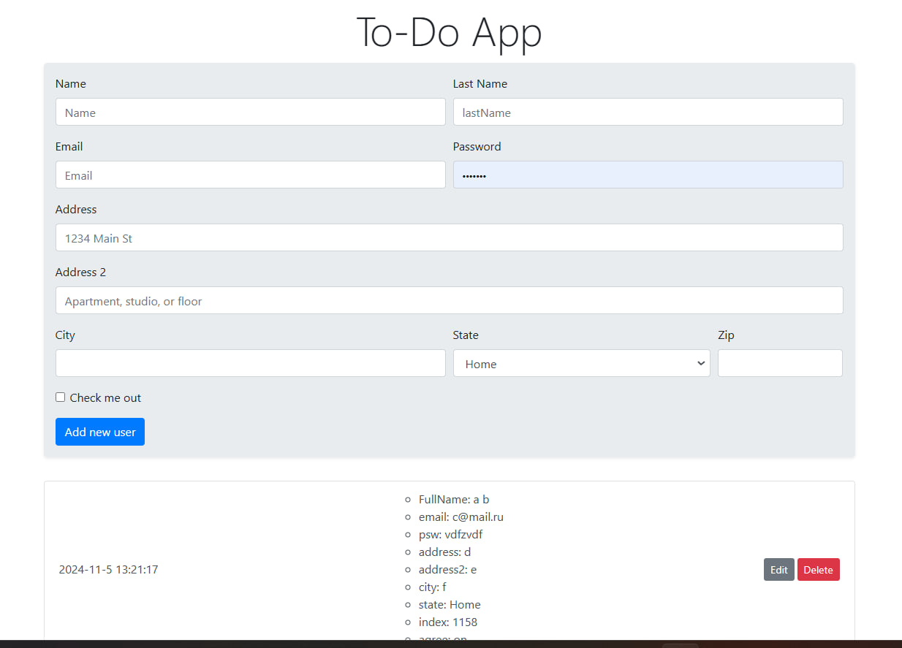

<div align="center">

<h2 align="center">To-Do App</h2>

<a href="https://astghik1100.github.io/To-Do-App">
<strong>➥ Live Demo</strong></a>

</div>

<br />

### Demo Screenshots



This is a To-Do List application that allows you to easily manage your tasks. You can add, delete, and edit tasks as needed. It supports localStorage, ensuring that all your changes will be saved even after refreshing or closing the page.


### Prerequisites

Before you begin, ensure you have met the following requirements:

* [Git](https://git-scm.com/downloads "Download Git") must be installed on your operating system.

### Run Locally

To run **Word Scramble** locally, run this command on your git bash:

Linux and macOS:

```bash
sudo git clone https://github.com/astghik1100/To-Do-App.git
```

Windows:

```bash
git clone https://github.com/astghik1100/To-Do-App.git
```


### License

This project is **free to use** and does not contains any license.